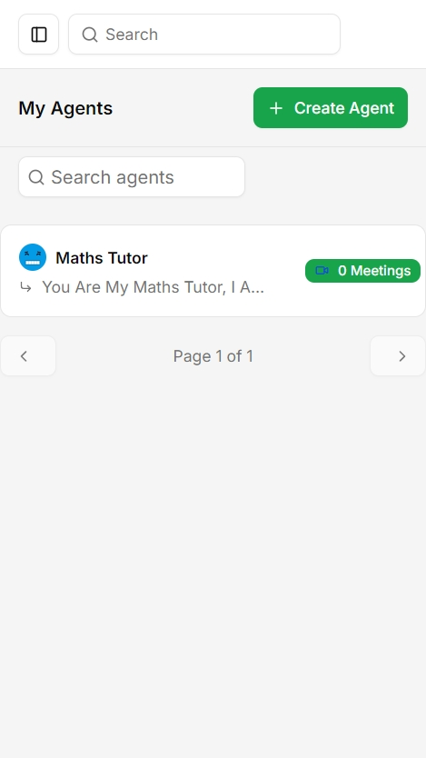

<br/>
<div align="center">

<a href="https://github.com/Sanchitmiok/SaaS-AI-Agent-Platform.git">
  
</a>

<h1 align="center">LiaiseAI 🚀</h1>

<p align="center">
  <b>A modern SaaS platform powered by AI to accelerate your business.</b>
</p>

<p align="center">
  <a href="https://github.com/Sanchitmiok/SaaS-AI-Agent-Platform/stargazers">
    
  </a>
  <a href="https://github.com/Sanchitmiok/SaaS-AI-Agent-Platform/blob/main/LICENSE">
    
  </a>
  <a href="https://github.com/Sanchitmiok/SaaS-AI-Agent-Platform/issues">
    
  </a>
</p>

<p align="center">
  <a href="https://liaiseai.vercel.app/sign-up"><b>🌐 View Live Demo</b></a>
</p>

</div>

---

## 🖥️ Product Preview

<div align="center">
  
  
</div>

---

## ✨ About The Project

LiaiseAI is a next-generation SaaS platform that leverages artificial intelligence to help businesses automate workflows, gain insights, and scale efficiently.  
Our mission is to empower teams with smart tools that save time and drive growth.

### 🚩 **Key Features**

- 🤖 **AI-powered workflow automation** — Automate repetitive business tasks with smart AI agents.
- 📊 **Real-time analytics & reporting** — Instantly visualize and track your business performance.
- 🔌 **Seamless integrations** — Connect with your favorite tools and platforms effortlessly.
- ☁️ **Scalable & secure cloud infrastructure** — Reliable, fast, and secure for teams of any size.
- 🧑‍💼 **Custom AI agent creation** — Build, train, and deploy your own AI agents for unique workflows.
- 📝 **Automated meeting summaries** — Get instant, accurate summaries and transcripts for every meeting.
- 📅 **Smart scheduling** — AI-powered meeting scheduling and calendar management.

---

## 🛠️ Built With

- [Next.js](https://nextjs.org)
- [React](https://reactjs.org)
- [TypeScript](https://www.typescriptlang.org)
- [Tailwind CSS](https://tailwindcss.com)
- [Node.js](https://nodejs.org)
- [Drzzle ORM](https://orm.drizzle.team/)
- [Neon Database](https://neon.com/)

---

## 🚀 Getting Started

To get a local copy up and running, follow these steps.

### Prerequisites

- Node.js >= 18.x
- npm >= 9.x

```sh
npm install npm@latest -g
```

### Installation

1. **Clone the repo**
   ```sh
   git clone https://github.com/Sanchitmiok/SaaS-AI-Agent-Platform.git
   cd SaaS-AI-Agent-Platform
   ```
2. **Install NPM packages**
   ```sh
   npm install
   ```
3. **Copy `.env.example` to `.env` and update environment variables as needed**
4. **Run the development server**
   ```sh
   npm run dev
   ```

---

## 💡 Usage

After starting the development server, open [http://localhost:3000](http://localhost:3000) to view the app.

---

## 🗺️ Roadmap

- [x] 🤖 AI-powered workflow automation
- [x] 🔐 User authentication & management
- [x] 🧑‍💼 Custom AI agent creation & management
- [x] 📅 Meeting scheduling & collaboration
- [x] 📝 Meeting summaries & transcripts
- [ ] 🛒 Marketplace for integrations
- [ ] 📈 Advanced analytics dashboard
- [ ] 🌎 Multi-language support
- [ ] 🤝 Team collaboration features
- [ ] 📱 Mobile app support

See the [open issues](https://github.com/Sanchitmiok/SaaS-AI-Agent-Platform/issues) for a full list of proposed features (and known issues).
---

## 🤝 Contributing

Contributions are what make the open source community such an amazing place to learn, inspire, and create.  
Any contributions you make are **greatly appreciated**!

1. **Fork the Project**
2. **Create your Feature Branch** (`git checkout -b feature/AmazingFeature`)
3. **Commit your Changes** (`git commit -m 'Add some AmazingFeature'`)
4. **Push to the Branch** (`git push origin feature/AmazingFeature`)
5. **Open a Pull Request**

Or simply open an issue with the tag "enhancement".  
Don't forget to give the project a ⭐! Thanks again!

---

## 📄 License

Distributed under the MIT License. See [MIT License](https://opensource.org/licenses/MIT) for more information.

---

## 📬 Contact

**LiaiseAI Team**  
[Twitter: @saasai_official](https://twitter.com/saasai_official)  
Email: contact@LiaiseAI.com

Project Link: [https://liaiseai.vercel.app](https://liaiseai.vercel.app/sign-up)

---

## 🙏 Acknowledgments

- [Next.js](https://nextjs.org)
- [Vercel](https://vercel.com)